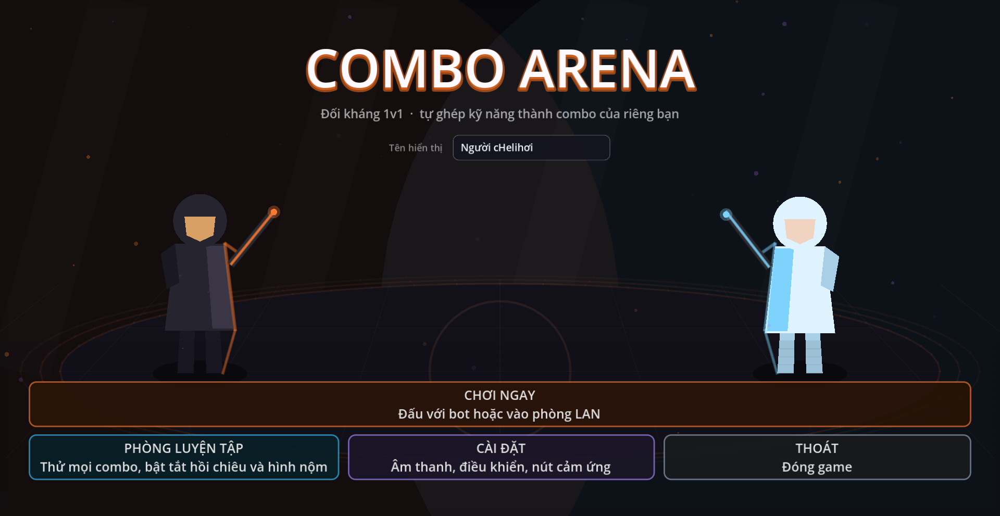
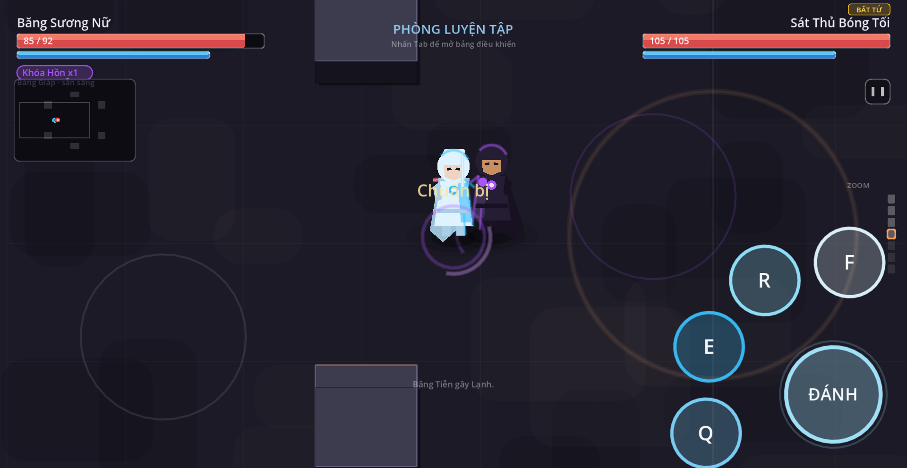
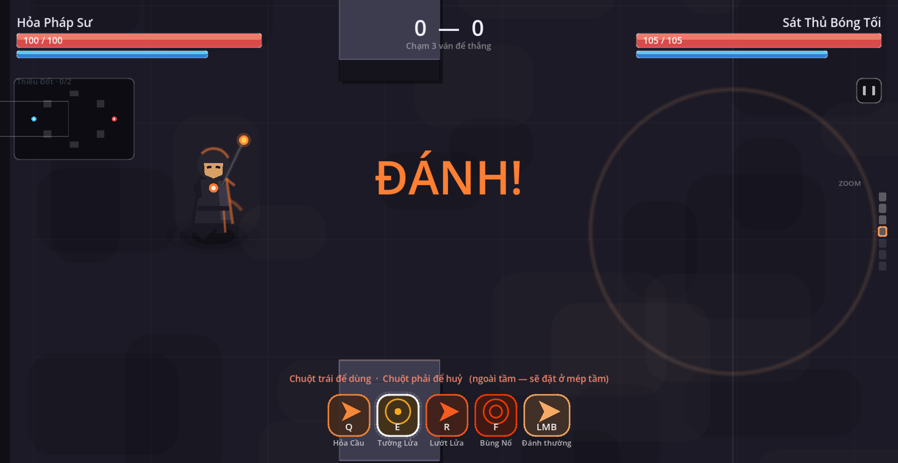
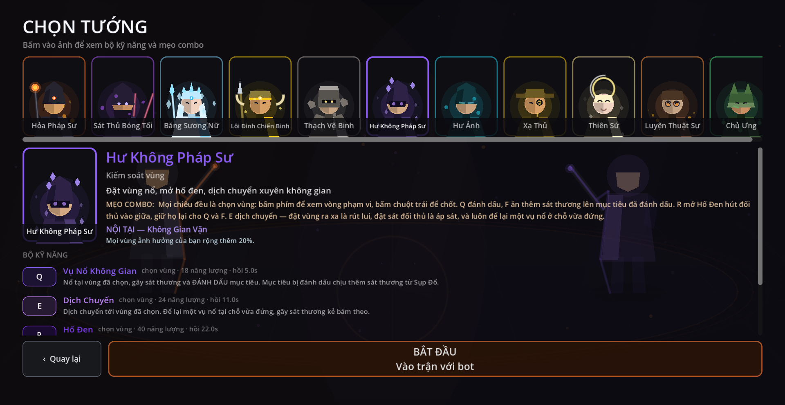
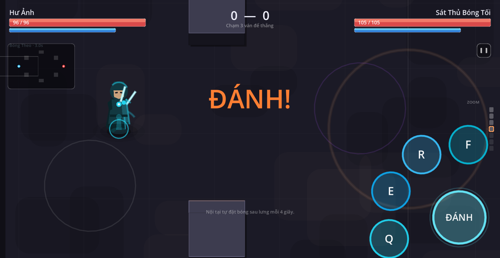
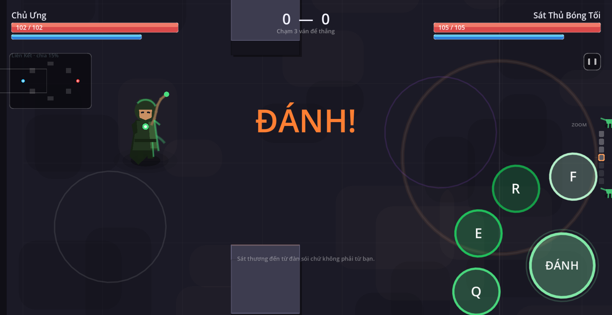
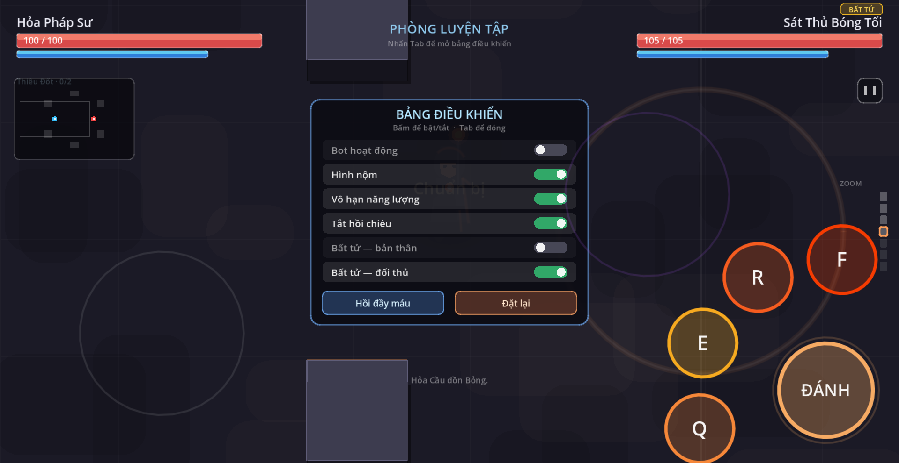
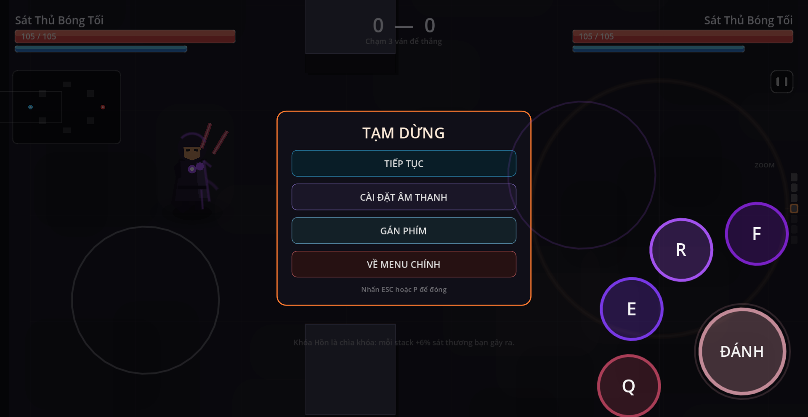

# Combo Arena

Game đối kháng **1v1**, góc nhìn từ trên xuống hơi xéo, 2D, chạy trên **Windows** và **Android**, chơi được qua **LAN**.

Điểm cốt lõi không phải là đánh trúng — mà là **tự nghĩ ra combo**. Mỗi kỹ năng để lại hoặc tiêu thụ một *trạng thái*, nên thứ tự ra chiêu quyết định kết quả. Game không dạy bạn combo nào cả; nó chỉ đưa ra luật để combo tự nảy ra.

Điểm thứ hai: **đạn bắn nhau được**. Hai viên đạn bay ngược chiều gặp nhau thì viên mạnh hơn đập vỡ viên yếu hơn, nhưng bị hao tầm bay đúng theo sức mạnh của viên nó vừa đè.

Điểm thứ ba: **chiêu phải chọn hướng hoặc chọn vùng**. Bấm phím kỹ năng chỉ là "lên đạn" — vòng phạm vi hiện ra, rồi bấm chuột trái mới thật sự ra chiêu.



---

## Chơi ngay

| Nền tảng | File | Ghi chú |
|---|---|---|
| Windows | `build/windows/ComboArena.exe` | Chạy trực tiếp, không cần cài gì |
| Android | `build/android/ComboArena-debug.apk` | Bản debug, đã ký. Bật "Cài từ nguồn không xác định" trên máy |

Mở file `.exe` là vào menu. Bấm **CHƠI NGAY** rồi chọn đấu với bot hoặc vào phòng LAN.

### Điều khiển

**Máy tính** — mọi phím đổi được ở Cài đặt → Gán phím.

| Hành động | Mặc định | Ghi chú |
|---|---|---|
| Di chuyển | `W A S D` | phím mũi tên cũng được |
| Ngắm | chuột | |
| Đánh thường | **chuột trái** | giữ để đánh liên tục |
| Kỹ năng 1–4 | `Q` `E` `R` `F` | phụ: `1` `2` `3` `4` |
| Xác nhận chiêu | **chuột trái** | khi đang chờ chọn vùng |
| Huỷ chiêu | **chuột phải** | |
| Zoom camera | cuộn chuột | hoặc `-` / `+` |
| Bảng luyện tập | `Tab` | chỉ trong phòng luyện tập |
| Tạm dừng | `P` hoặc nút `‖` góc trên phải | Pause: Tiếp tục / Cài đặt / Gán phím / Về menu |
| Lùi một bước | `ESC` | huỷ chiêu → đóng bảng → về menu |

`W` cố ý để trống cho di chuyển. Bản đầu dùng `Q W E R` nên `W` vừa đi lên vừa ra chiêu — đã bỏ hẳn.

**Android** — hai ngón cái, mỗi bên một nửa màn hình.

- **Nửa trái**: cần di chuyển, xuất hiện đúng chỗ ngón tay chạm
- **Nửa phải**: cần ngắm. Không đụng thì tự nhắm đối thủ gần nhất
- **Cụm góc dưới phải**: 4 nút kỹ năng xếp thành cung quạt + nút **ĐÁNH** to nhất
- **Chiêu chọn vùng**: bấm giữ nút kỹ năng rồi **kéo** — hướng kéo là hướng chiêu, độ dài kéo là tầm với. Thả ra để dùng. Kéo vào ô **X** rồi thả để huỷ



---

## Chọn vùng và chọn hướng

Đây là thay đổi lớn nhất so với bản đầu. Mỗi kỹ năng có một **loại chiêu**:

| Loại | Cách dùng | Ví dụ |
|---|---|---|
| `theo hướng` | bấm phím → hiện hình quạt chỉ hướng → chuột trái để bắn | Hỏa Cầu, Băng Tiễn |
| `chọn vùng` | bấm phím → hiện vòng tầm + vòng vùng nổ → chuột trái để chốt | Tường Lửa, Thiên Lôi, Hố Đen |
| `quanh người` | bấm là ra ngay, không cần chọn gì | Bùng Nổ, Vòng Băng |

Khi đang chờ chọn, HUD hiện vòng tầm quanh tướng, vòng vùng nổ ở điểm đang trỏ, và đường nối giữa hai chỗ. Ô kỹ năng đang chờ được viền trắng nhấp nháy. Nếu điểm ngoài tầm thì vòng chuyển đỏ và ghi rõ "sẽ đặt ở mép tầm".

Điểm ngoài tầm vẫn bấm được — chiêu sẽ đặt ở mép tầm thay vì bị từ chối. Người chơi đã bấm xác nhận thì nên ra chiêu, chỉ là không với tới chỗ quá xa.



---

## Mười một tướng

Mỗi tướng có **4 kỹ năng + 1 đánh thường riêng**, cộng **một nội tại độc nhất** (không trùng giữa các tướng). Đánh thường không tốn năng lượng, hồi chiêu ngắn.

**Ba loại chiêu**:
- **theo hướng** — bấm phím, ra chiêu theo hướng ngắm
- **chọn vùng** — bấm phím lên đạn, vòng tầm sáng cyan, bấm chuột trái chốt, chuột phải/ESC hủy. Trên điện thoại: giữ nút → kéo (hướng + tầm) → thả để dùng, kéo vào nút **X** để hủy
- **quanh người** — bấm phím là ra ngay, không cần chọn

| # | Tướng | Vai trò | Nội tại |
|---|---|---|---|
| 1 | Hỏa Pháp Sư | Sát thương bùng nổ | Thiêu Đốt — 2 đánh thường cộng 1 stack Bỏng + 6% sát thương |
| 2 | Sát Thủ Bóng Tối | Ám sát cận chiến | Đòn Chuẩn — trúng mục tiêu bị Khóa Hồn hoàn 1s hồi chiêu đánh thường |
| 3 | Băng Sương Nữ | Khống chế | Băng Giáp — bị đánh 25% cơ hội đóng băng kẻ tấn công 0.4s |
| 4 | Lôi Đình Chiến Binh | Sát thương lan | Sạc Kép — cứ 3 chiêu ra thì chiêu thứ 3 bắn thêm 1 lần nữa (50% sát thương) |
| 5 | Thạch Vệ Binh | Chống chịu, đè đạn | Vỏ Bọc — đứng yên 1.5s liên tục giảm 25% sát thương chịu |
| 6 | Hư Không Pháp Sư | Kiểm soát vùng | Không Gian Vặn — mọi chiêu chọn vùng có bán kính +20% |
| 7 | Hư Ảnh | Sát thủ dịch chuyển | Bóng Theo — cứ 4s tự đặt bóng tại vị trí hiện tại |
| 8 | Xạ Thủ | Bắn xa tầm nhìn | Tâm Điểm — đứng yên sạc tới +50% sát thương đánh thường |
| 9 | Thiên Sứ | Hỗ trợ / hồi máu | Phước Lành — mỗi lần hồi máu +20% thành khiên |
| 10 | Luyện Thuật Sư | Đặt bẫy + máy móc | Chế Tạo — cứ 8s tự đặt mìn ở vị trí an toàn gần nhất |
| 11 | Chủ Ưng | Triệu hồi | Liên Kết — bạn nhận 15% sát thương mà đàn thú phải chịu |

### 1. Hỏa Pháp Sư — dồn Bỏng rồi kích nổ

| Phím | Skill | Loại | Tác dụng |
|---|---|---|---|
| `LMB` | Tia Lửa | theo hướng | Bắn nhanh, không tốn năng lượng |
| `Q` | Hỏa Cầu | theo hướng | Sát thương + **1 stack Bỏng** |
| `E` | Tường Lửa | **chọn vùng** | Vùng lửa gây sát thương theo nhịp, **nâng cao** mục tiêu đang Bỏng 0.3s |
| `R` | Lướt Tung Lửa | theo hướng | Lướt + **cung lửa hai bên**. Xuyên qua người đang Bỏng → hồi chiêu ngay + 1 stack |
| `F` | Bùng Nổ | quanh người | Tiêu thụ toàn bộ stack Bỏng. Sát thương = `14 + 9 × stack`, **kéo đối thủ vào tâm 0.3s** |

### 2. Sát Thủ Bóng Tối — đánh dấu rồi kết liễu

| Phím | Skill | Loại | Tác dụng |
|---|---|---|---|
| `LMB` | Đâm Nhanh | theo hướng | Chém tầm gần |
| `Q` | Chém Đôi | theo hướng | Mục tiêu **bị Khóa Hồn** nhận thêm sát thương và bạn hồi máu |
| `E` | Ảnh Bộ Tức Thì | **INSTANT** | Lướt theo hướng ngắm, hồi 3s. **Bấm lần nữa trong 1s để lướt tiếp** (chuỗi 2 lần) |
| `R` | Khóa Hồn | theo hướng | **1 stack Khóa Hồn** (tối đa 3). Mỗi stack +6% sát thương bạn gây ra |
| `F` | Tử Ảnh | quanh người | `30 + 20 × stack`. **Dưới 35% máu ×2.5**, hồi toàn bộ hồi chiêu nếu hạ |

### 3. Băng Sương Nữ — khống chế

| Phím | Skill | Loại | Tác dụng |
|---|---|---|---|
| `LMB` | Tia Băng | theo hướng | Mảnh băng nhỏ, kèm chút Lạnh |
| `Q` | Băng Tiễn | theo hướng | **Mục tiêu đã bị Lạnh → chuyển thành ĐÓNG BĂNG** |
| `E` | Tường Băng | **chọn vùng** | Dựng tường băng dài 320px, **chặn cả đạn lẫn người** trong 4s |
| `R` | Trượt Băng | theo hướng | Lướt, để lại vệt băng làm chậm |
| `F` | Tuyệt Đối Đóng Băng | quanh người | Đóng băng diện rộng + **Vỡ Giáp** |

### 4. Lôi Đình Chiến Binh — sát thương lan

| Phím | Skill | Loại | Tác dụng |
|---|---|---|---|
| `LMB` | Tia Chớp | theo hướng | Tia điện nhỏ |
| `Q` | Sét Đánh | theo hướng | **Trúng mục tiêu đang Tích Điện → sét LAN sang kẻ đứng gần** |
| `E` | Lướt Lôi Đình | theo hướng | Lướt có **vết sét** ở chỗ cũ, **lướt xuyên đối thủ → choáng 0.4s** |
| `R` | Nạp Điện | quanh người | Bản thân nhận **Chí Mạng** + cắm Tích Điện lên đối thủ quanh người |
| `F` | Thiên Lôi | **chọn vùng** | Sét giáng + choáng nếu Tích Điện |

### 5. Thạch Vệ Binh — chống chịu, đè đạn mạnh nhất

| Phím | Skill | Loại | Tác dụng |
|---|---|---|---|
| `LMB` | Ném Đá | theo hướng | Bay chậm nhưng nặng |
| `Q` | Đá Lăn | theo hướng | **Sức mạnh đạn cao nhất game** — đè bẹp mọi đòn tầm xa |
| `E` | Vách Đá | **chọn vùng** | **Cột đá dọc** 280px cao, chặn đạn + nhân vật trong 4s |
| `R` | Khiên Đá | quanh người | Khiên + dán **Vỡ Giáp** lên đối thủ gần |
| `F` | Địa Chấn | quanh người | Hất văng + choáng |

### 6. Hư Không Pháp Sư — đặt vùng và dịch chuyển

Tướng dạy luồng chọn vùng: **gần như mọi chiêu đều là `chọn vùng`**. Nội tại +20% bán kính mọi chiêu.

| Phím | Skill | Loại | Tác dụng |
|---|---|---|---|
| `LMB` | Tia Hư Không | theo hướng | Tia năng lượng tím |
| `Q` | Vụ Nổ Không Gian | **chọn vùng** | Nổ tại vùng đã chọn, **ĐÁNH DẤU** mục tiêu |
| `E` | Dịch Chuyển | **chọn vùng** | Dịch chuyển tới vùng đã chọn, **để lại một vụ nổ ở chỗ vừa đứng** |
| `R` | Hố Đen | **chọn vùng** | **HÚT** mọi đối thủ quanh đó vào tâm, kèm sát thương theo nhịp và làm chậm |
| `F` | Sụp Đổ | **chọn vùng** | Nứt không gian, **có vòng cảnh báo trước gần 1 giây**. Mục tiêu bị Đánh Dấu chịu thêm sát thương và bị choáng |

`E` là chiêu thú vị nhất: đặt vùng ra xa là rút lui, đặt sát đối thủ là áp sát — cùng một chiêu, hai cách dùng hoàn toàn khác nhau.



### 7. Hư Ảnh — lướt né rồi đánh trả

Tướng **lướt hồi 3 giây**, lướt để lại bóng tại chỗ cũ, rồi có thể quay về bóng bất cứ lúc nào. Chơi kiểu *blink-in, đánh, blink-out*.

| Phím | Skill | Loại | Tác dụng |
|---|---|---|---|
| `LMB` | Ảnh Kiếm | theo hướng | Dao nhanh |
| `Q` | Tốc Biến | **INSTANT** | Lướt tức thì theo hướng ngắm, **hồi 3s**, **để lại bóng** tại chỗ cũ |
| `E` | Đổi Bóng | theo hướng | Lướt + **hoán đổi vị trí với bóng gần nhất**. Hồi 5s |
| `R` | Bóng Bội | **chọn vùng** | Đặt vùng — chiêu ra tiếp theo **bắn thêm 1 bản từ bóng** |
| `F` | Đâm Từ Bóng | theo hướng | Dịch chuyển ra sau lưng mục tiêu gần nhất, đâm + hoán đổi với bóng |

Chuỗi đẹp nhất: `Q lướt xuyên qua → đánh vài nhát → E quay về bóng cũ` — đối thủ không biết bạn đang ở đâu.



### 8. Xạ Thủ — bắn xa tầm nhìn

Tướng **bắn tỉa**. Nội tại Tâm Điểm: đứng yên → sạc lực, tối đa +50% sát thương đánh thường — di chuyển là mất sạch. Chơi kiểu *đứng một chỗ, aim, bắn xuyên*.

| Phím | Skill | Loại | Tác dụng |
|---|---|---|---|
| `LMB` | Đạn Tiễu | theo hướng | Đạn nhanh, hồi 0.25s |
| `Q` | Xuyên Thấu | theo hướng | Đạn lớn xuyên qua 3 mục tiêu |
| `E` | Bước Lùi Súng | theo hướng | **Lướt NGƯỢC hướng ngắm** (giữ khoảng cách nhưng vẫn giữ hướng bắn), để lại bẫy làm chậm |
| `R` | Ống Nhòm | **INSTANT** | Tăng tầm bắn gấp 2 + sát thương x2, **đứng yên bắt buộc 4s** |
| `F` | Phát Súng Cuối | **chọn vùng** | Đạn cực lớn xuyên nhiều mục tiêu |

### 9. Thiên Sứ — hỗ trợ, hồi máu, khiên phản đòn

Tướng **phô diễn kiểu bảo kê**. Thắng bằng cách sống lâu chứ không phải giết nhanh.

| Phím | Skill | Loại | Tác dụng |
|---|---|---|---|
| `LMB` | Quyền Trượng | theo hướng | Gậy đập tầm gần |
| `Q` | Sóng Ánh Sáng | theo hướng | Sóng năng lượng gây sát thương + làm chậm |
| `E` | Khiên Phước | **quanh người** | Khiên **phản 30% sát thương đạn** về kẻ bắn |
| `R` | Vùng Thiêng | **chọn vùng** | Đặt vùng hồi máu theo nhịp + **tăng tốc** cho ai đứng trong |
| `F` | Thiên Khai | **chọn vùng** | Sấm sét giáng xuống vùng chọn, sát thương lớn + choáng |

### 10. Luyện Thuật Sư — rải mìn, dựng trụ, đặt bẫy

Tướng **thiên về setup**. Nội tại tự rải mìn ở vị trí an toàn gần nhất mỗi 8 giây. Người chơi giỏi sẽ dồn đối thủ vào một góc đã chuẩn bị sẵn.

| Phím | Skill | Loại | Tác dụng |
|---|---|---|---|
| `LMB` | Búa Cơ Khí | theo hướng | Búa ngắn |
| `Q` | Mìn Nổ | **chọn vùng** | Đặt mìn từ từ, phát nổ khi đối thủ chạm |
| `E` | Súng Điện | theo hướng | Bắn 3 phát liên tiếp, mỗi phát tăng tốc |
| `R` | Bẫy Laser | **chọn vùng** | Hàng rào laser vuông góc với hướng ngắm, đối thủ đi qua mất máu + chậm |
| `F` | Pháo Cố Định | **chọn vùng** | Dựng trụ pháo, tự động bắn trong 4s, 3 phát bị tấn công là sập |

### 11. Chủ Ưng — gọi đàn sói, chỉ huy chúng lao vào đối thủ

Sát thương đến từ **đàn thú chứ không phải từ bạn**. Đối thủ phải chọn giữa bắn bạn hay bắn thú — cả hai đều là sai lầm.

| Phím | Skill | Loại | Tác dụng |
|---|---|---|---|
| `LMB` | Roi Da | theo hướng | Đánh tầm gần, hồi 0.35s |
| `Q` | Triệu Hồ | **chọn vùng** | Đặt một con Sói tại vùng chọn, tự tìm mục tiêu gần nhất và cắn 5s |
| `E` | Khống Chế | theo hướng | **Sói hiện có** lao tới mục tiêu, cắn + choáng 0.5s |
| `R` | Đàn Bầy | **quanh người** | Triệu thêm 2 Sói (tổng 3), tất cả tồn tại 5s |
| `F` | Sói Đoàn | **theo hướng** | Bạn + mọi Sói **cùng lao về hướng ngắm**, gây sát thương trên đường |

Nội tại Liên Kết: bạn nhận 15% sát thương mà đàn thú phải chịu. Giết mục tiêu bằng thú → hồi `Q` 50%.



---

## Phòng luyện tập

Vào từ menu chính. Không có ván thắng thua, không đếm ngược — chỉ có chỗ để thử combo.

Nhấn **Tab** để mở bảng điều khiển:

| Mục | Tác dụng |
|---|---|
| Bot hoạt động | Tắt thì đối thủ đứng yên nhưng vẫn ăn đòn |
| Hình nộm | Đối thủ đứng yên và bất tử, để đo sát thương |
| Vô hạn năng lượng | Không phải chờ hồi năng lượng giữa các lần thử |
| Tắt hồi chiêu | Thử một chuỗi liên tục mà không phải chờ |
| Bất tử — bản thân | Không phải chạy lại từ đầu mỗi lần sai |
| Bất tử — đối thủ | Giữ mục tiêu sống để đánh tiếp |
| Hồi đầy máu / Đặt lại | Hai nút hành động |

Chết trong phòng luyện tập thì tự hồi sinh sau 1.4 giây, không mất gì.

Sát thương hiện thành số bay lên trên đầu nạn nhân — đòn nặng thì chữ to và vàng, sát thương theo nhịp thì chữ nhỏ. Không có số thì không ai biết đòn kích nổ ăn 40 hay 120 sát thương, tức là không học được gì từ việc thử.



---

## Minimap và zoom

**Minimap** ở góc trên trái: hiện vật cản, tường do kỹ năng tạo, vị trí hai tướng, và khung nhìn của camera. Đặt ở góc trên chứ không phải góc dưới vì hai góc dưới đã thuộc về ngón tay cái.

**Zoom** đổi bằng cuộn chuột hoặc `-` / `+`. Bảy mức từ 0.85 (nhìn rộng) tới 2.05 (nhìn gần). Thước chỉ báo nằm ở mép phải màn hình.

---

## Tạm dừng và cài đặt trong trận

Bấm `P` hoặc nút `‖` góc trên phải HUD để mở menu tạm. Bốn nút: **Tiếp tục / Cài đặt âm thanh / Gán phím / Về menu chính**. Trước đây phải đánh xong mới đổi phím được — giờ đổi được giữa trận.

`ESC` là nút "lùi một bước" theo thứ tự ưu tiên: đang chờ chọn vùng thì **huỷ chiêu**; đang mở bảng luyện tập thì **đóng bảng**; còn không thì **về menu**. Nhờ vậy không bao giờ thoát game ngoài ý muốn chỉ vì đang lỡ bấm dở một chiêu.



---

## Dash-cancel

Đây là cơ chế "phô diễn" chính. Trong khi đang chờ chọn vùng cho một chiêu:

- Bấm **chiêu khác** → đổi sang chiêu mới, chiêu cũ hoàn 30% hồi chiêu
- Bấm **lướt / tốc biến / dịch chuyển** → huỷ chiêu đang chờ, lướt luôn, chiêu bị huỷ hoàn 30% hồi chiêu

Người chơi giỏi sẽ bấm chiêu mạnh để dọa đối thủ, thấy đối thủ né thì lướt đi — chiêu bị huỷ nhưng mất ít hồi. Người chơi tệ thì bấm hụt và mất cả chiêu lẫn cooldown. Đây là cách Liên Quân và Liên Minh thưởng cho tay nghề: sai lầm có hậu quả, nhưng bẻ lái đúng lúc có thưởng.

---

## Nội tại

Mỗi tướng có **một nội tại độc nhất**, kích hoạt bị động hoặc theo nhịp. Tên và biểu tượng hiện ở góc trên trái HUD.

| Tướng | Nội tại | Loại |
|---|---|---|
| Hỏa Pháp Sư | Thiêu Đốt | Đánh thường cộng dồn Bỏng |
| Sát Thủ Bóng Tối | Đòn Chuẩn | Hoàn cooldown đánh thường |
| Băng Sương Nữ | Băng Giáp | Phản đòn đóng băng kẻ tấn công |
| Lôi Đình Chiến Binh | Sạc Kép | Mỗi 3 chiêu bắn thêm 1 bản sao |
| Thạch Vệ Binh | Vỏ Bọc | Đứng yên → giảm sát thương chịu |
| Hư Không Pháp Sư | Không Gian Vặn | +20% bán kính chiêu chọn vùng |
| Hư Ảnh | Bóng Theo | Tự đặt bóng sau lưng mỗi 4 giây |
| Xạ Thủ | Tâm Điểm | Đứng yên → sạc +50% sát thương |
| Thiên Sứ | Phước Lành | Hồi máu → sinh thêm khiên |
| Luyện Thuật Sư | Chế Tạo | Tự rải mìn sau lưng mỗi 8 giây |
| Chủ Ưng | Liên Kết | Nhận 15% sát thương đàn thú phải chịu |

---

## Đạn va chạm nhau

Mỗi viên đạn có `power` (sức mạnh) và `life` (tầm bay còn lại). Hai viên của hai phe chạm nhau:

| Trường hợp | Kết quả |
|---|---|
| Ngang sức | Cả hai cùng tan |
| Lệch nhau | Viên yếu tan; viên mạnh **mất tầm bay tỉ lệ với sức mạnh viên vừa bị đè** |

Thang `power`: đánh thường 0.9 · Phi tiêu 1.8 · Hỏa Cầu 2.2 · Băng Tiễn 2.6 · **Đá Lăn 4.5**.

Đá Lăn gần như không thể bị chặn. Đổi lại nó bay chậm và hồi chiêu lâu.

---

## Tương tác chéo giữa các tướng

Các trạng thái dùng chung một "từ vựng" nên tướng này mở đường cho tướng kia:

- **Băng Sương Nữ `F` dán Vỡ Giáp** → **Thạch Vệ Binh `F`** đánh vào chỗ đó để choáng
- **Lôi Đình `E`/`R` gắn Tích Điện** → **Lôi Đình `Q`** lan sang mục tiêu gần
- **Hư Không `Q` đánh dấu** → **Hư Không `F`** ăn thêm 26 sát thương mỗi stack
- **Hư Không `R` hút** → giữ đối thủ trong tầm cho mọi chiêu chọn vùng khác
- **Hỏa Pháp Sư dồn Bỏng** → **Băng Sương Nữ `F`** khoá chân để Hỏa Pháp Sư `F` kịp nổ

Chín trạng thái: `Bỏng`, `Khóa Hồn`, `Chậm`, `Khiên`, `Chí Mạng`, `Đóng Băng`, `Tích Điện`, `Vỡ Giáp`, `Tăng Tốc`. Màu và tên hiện thành chip dưới thanh máu.

---

## Âm thanh

Không có file âm thanh nào trong project. Mọi tiếng động được **tổng hợp bằng code** lúc khởi động: vài hàm sóng cơ bản (sine, vuông, răng cưa, tam giác) cộng nhiễu, ghép lại và bọc đường bao, rồi nhét vào `AudioStreamWAV`.

Vì sao: không vướng bản quyền, không phụ thuộc file ngoài, đổi âm sắc bằng cách sửa một con số, dung lượng gần như bằng không.

Khoảng 30 tiếng: mỗi kỹ năng một tiếng riêng, cộng tiếng trúng đòn, hạ gục, va chạm đạn (ba biến thể), giao diện, và một lớp nền trầm lặp vô tận.

---

## Cấu trúc mã nguồn

```
scripts/
  autoload/     InputSetup (bảng phím + gán lại phím), GameData (hằng số, sổ tướng,
                mẹo combo, nội tại), Net (mạng LAN), Settings (cấu hình), Audio (tổng hợp âm thanh)
  core/         StatusEffect — nền tảng của hệ thống combo, Passive — lớp cơ sở cho nội tại
  skills/       SkillBase — lớp cơ sở: loại chiêu, tầm, vùng, hàm tìm mục tiêu
  champions/    11 tướng (xem bảng bên trên) — mỗi file chứa tướng, 5 chiêu, và nội tại
  entities/     Champion (chỉ số, status, mô phỏng, kẹp vào sân),
                ChampionVisual (vẽ vector), Projectile (đạn, vùng, va chạm, lực hút)
  world/        Arena (sân, vật cản, va chạm đạn), Game (luật chơi, vòng đấu,
                phòng luyện tập, chọn vùng), BotBrain (AI), DamageNumber
  ui/           HUD, MainMenu (bốn màn), MenuBackdrop, ChampionPortrait,
                CastIndicator, KeybindsPanel, ModeCard, TouchControls
scenes/         MainMenu.tscn, Game.tscn
tools/          Capture.tscn (chụp ảnh kiểm tra), build.sh (đóng gói)
```

Toàn bộ hình ảnh nhân vật cũng vẽ bằng vector trong `_draw()` — không có file sprite nào. Lý do giống bên âm thanh: không vướng bản quyền, đổi màu bằng một dòng code, và icon trong menu luôn khớp với nhân vật ngoài sân vì dùng chung một bảng màu.

### Muốn thêm tướng mới

1. Tạo `scripts/champions/TenTuong.gd`, viết `build_champion(c)`, `build_passive()`, các lớp skill con. Mỗi skill khai báo `cast_type` / `cast_range` / `aoe_radius` trong `_init()`.
2. Thêm một dòng vào `CHAMPION_SCRIPTS`, `CHAMPION_ORDER`, `CHAMPION_INFO`, `COMBO_HINTS` trong `scripts/autoload/GameData.gd`.
3. Thêm bảng màu vào `PALETTES` trong `ChampionVisual.gd`, một nhánh vũ khí trong `_draw_weapon`, và một nhánh trong `_draw_headgear` / `_draw_face` / `_draw_motifs` của `ChampionPortrait.gd`.
4. Thêm một nhánh trong `BotBrain._decide` và `_preferred_range_for`.
5. Nếu tướng có chiêu thú (Sói Tinh Linh), trụ đặt (Pháo Cố Định), mìn, v.v. — thêm hàm `_draw_*` tương ứng trong `Projectile.gd` để có hình riêng.

Không phải sửa gì ở tầng mạng, HUD, hay đấu trường.

---

## Về phần mạng

Mô hình **host-authoritative**: máy chủ phòng mô phỏng cả hai tướng, máy khách chỉ gửi *ý định* (hướng đi, hướng ngắm, phím vừa bấm, điểm đặt chiêu) lên rồi nhận kết quả về. Nhờ vậy hai bên không bao giờ lệch máu hay thấy đòn đánh ảo.

Trên LAN độ trễ thường 1-5ms nên không cần client-side prediction — cảm giác vẫn tức thì.

Phòng được tìm tự động qua beacon UDP broadcast, nên **không phải gõ IP**. Vẫn có ô nhập IP cho trường hợp mạng chặn broadcast.

---

## Tự build lại

Cần Godot 4.7. Bản engine đã tải sẵn ở `../_engine/Godot_v4.7.2-stable_win64_console.exe`.

Cách gọn nhất:

```bash
tools/build.sh
```

Script tự kiểm tra lỗi script trước, rồi đóng gói cả hai nền tảng. Cuối cùng nó
**mở sản phẩm ra đếm thử có đủ 11 tướng không** — nếu không đạt thì báo lỗi thay
vì để lại file cũ từ lần build trước.

Kiểm tra riêng cũng được:

```bash
python tools/verify_build.py
```

Hoặc gọi thẳng Godot. **Lưu ý quan trọng: phải chạy từ thư mục ngoài project và truyền `--path` tuyệt đối.**

```bash
cd /tmp
GODOT="C:/Users/ASUS/workbuddy-ai/Hack/_engine/Godot_v4.7.2-stable_win64_console.exe"
PROJ="C:/Users/ASUS/workbuddy-ai/Hack/combo-arena"

"$GODOT" --headless --path "$PROJ" \
  --export-release "Windows Desktop" "$PROJ/build/windows/ComboArena.exe"
"$GODOT" --headless --path "$PROJ" \
  --export-debug "Android" "$PROJ/build/android/ComboArena-debug.apk"
```

### Vì sao build script phải tự đặt `APPDATA`

Có ba nguyên nhân độc lập làm Godot rơi vào chế độ **self-contained** — lúc đó
nó tạo một thư mục `Godot/` ngay trong project và đọc cấu hình từ đó thay vì
`%APPDATA%/Godot/`. Cả ba đều phải xử lý, thiếu một là hỏng:

| # | Nguyên nhân | Xử lý |
|---|---|---|
| 1 | `APPDATA` rỗng trong shell (Git Bash / MSYS / CI hay không truyền biến này) | Script tự suy từ `USERPROFILE` |
| 2 | Thư mục làm việc nằm trong project | Chạy từ thư mục trung gian + `--path` tuyệt đối |
| 3 | Thư mục `Godot/` rơi rớt từ lần chạy trước | Xoá trước khi build |

Cái nguy hiểm nhất là **(1)**, vì log **không nhắc đến APPDATA** — Godot chỉ than:

```
No export template found at the expected path:
./Godot/export_templates/4.7.2.stable/windows_release_x86_64.exe
```

Đọc lướt tưởng thiếu template. Thực ra template vẫn nằm yên trong
`%APPDATA%/Godot/export_templates/`, Godot chỉ không tìm thấy `%APPDATA%`.

Ở chế độ self-contained, export Android còn báo thêm:

```
A valid Java SDK path is required in Editor Settings.
```

…dù đường dẫn hoàn toàn đúng. Thư mục `Godot/` đã được thêm vào `.gitignore`.

**Hậu quả tệ nhất:** export thất bại nhưng file `.exe` cũ từ lần build trước vẫn
nằm đó, trông như bình thường. Người dùng mở lên thấy bản cũ. Đó là lý do
`build.sh` có bước `tools/verify_build.py` ở cuối.

### Phát hành Android bản chính thức

Bản `--export-release` cho Android **cố tình không build được** vì chưa có keystore riêng. Đây là điều đúng: đừng bao giờ phát hành bằng khoá dùng chung.

```bash
keytool -genkeypair -v -keystore release.keystore -alias comboarena \
  -keyalg RSA -keysize 2048 -validity 10000
```

---

## Chụp ảnh kiểm tra giao diện

`tools/Capture.tscn` chạy game thật rồi lưu ảnh vào `user://shots`.

```bash
cd /tmp
"$GODOT" --path "$PROJ" --resolution 1280x720 --windowed res://tools/Capture.tscn
```

Phải chạy **không** có `--headless`: chế độ headless không có bộ render nên `get_viewport().get_texture()` trả về null. Và không dùng `await RenderingServer.frame_post_draw` — tín hiệu đó không bao giờ phát ra ở headless nên tiến trình treo vô hạn.

---

## Còn thiếu gì

- **Bot đã giỏi hơn** — biết cast theo phạm vi, đặt vùng theo hướng đối thủ sẽ tới, dùng `skills_enabled` để thành bao cát. Nhưng vẫn **không né đòn** và **không biết chặn đạn** — đây là hai thứ ảnh hưởng cảm giác chơi nhiều nhất.
- **Chưa có màn chọn tướng cho đối thủ trong trận LAN** — hiện mỗi bên chọn tướng của mình.
- **Chưa test trên Android thật.** APK đã build và ký thành công nhưng chưa chạy thử trên máy.
- **Chưa test LAN giữa hai máy thật.**
- **Chưa có màn tổng kết best-of.** Có đếm ván thắng nhưng chưa có màn kết thúc trận.
- **Một số hiệu ứng kỹ năng mới** (Sụp Đổ, Hố Đen, Trụ Pháo, Bẫy Laser, Sói Tinh Linh) đã có hình riêng trong `Projectile._draw_*`; vài chiêu vẫn dùng hiệu ứng chung.
